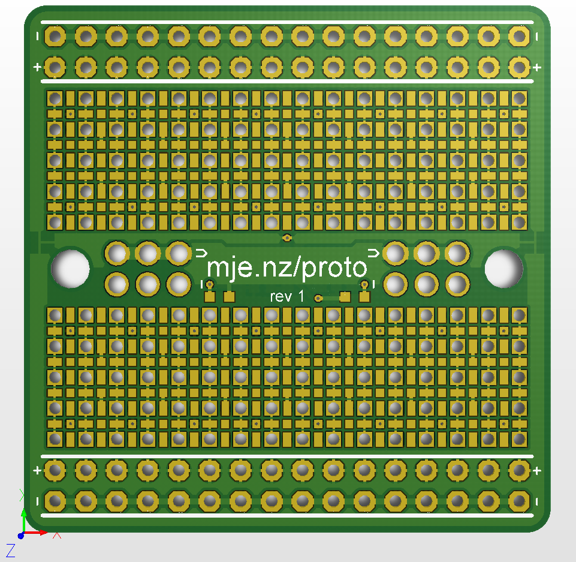

# Protoboard

This project is inspired by [Adafruit's Perma-Proto range](https://www.adafruit.com/category/466), [ElectronicEel's protoboard layout](https://github.com/electroniceel/protoboard), and [BusBoard Prototype System's SMT protoboards](https://busboard.com/SP1-50x50-G).

Details:

* 0.1"-pitch 1mm plated-through holes, connected like a standard solderless breadboard (16 rows long)
* Ground/power rails, connected internally
* 50mil-pitch surface-mount pads, with a few connected together and a few connected to ground
* Full ground plane on bottom side
* (hopefully) solder mask slivers between pads
* Power distribution section for a second voltage, with 1.5mm plated-through holes
* Optional voltage regulator
* Optional power LED on each voltage rail
* 2x M3 non-plated mounting holes, spaced 1.4" apart
* 1.7" (43.18mm) square
* USD$2 (plus shipping) for 5 at JLCPCB, or for 20 if panelised

Supported packages:

* Standard 0.1"-pitch headers
* DIP chips
* SOIC, SOT-23, SOT-323, SOT-416
* SOT-89, SOT-223, TO-252/DPAK (I assume)
* 0402, 0603, 0805
